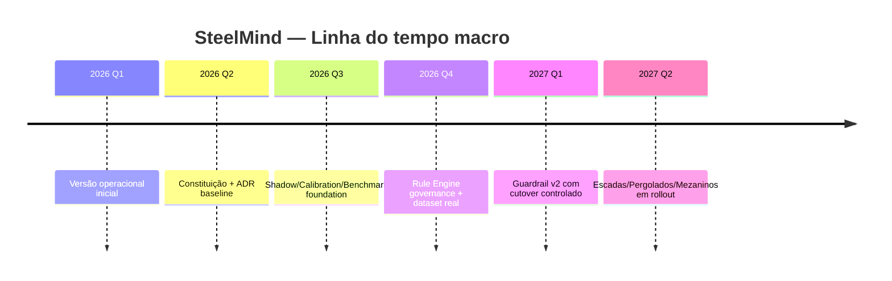

# Timeline do programa

```mermaid
timeline
    title SteelMind — Linha do tempo macro
    2026 Q1 : Versão operacional inicial
    2026 Q2 : Constituição + ADR baseline
    2026 Q3 : Shadow/Calibration/Benchmark foundation
    2026 Q4 : Rule Engine governance + dataset real
    2027 Q1 : Guardrail v2 com cutover controlado
    2027 Q2 : Escadas/Pergolados/Mezaninos em rollout
```
