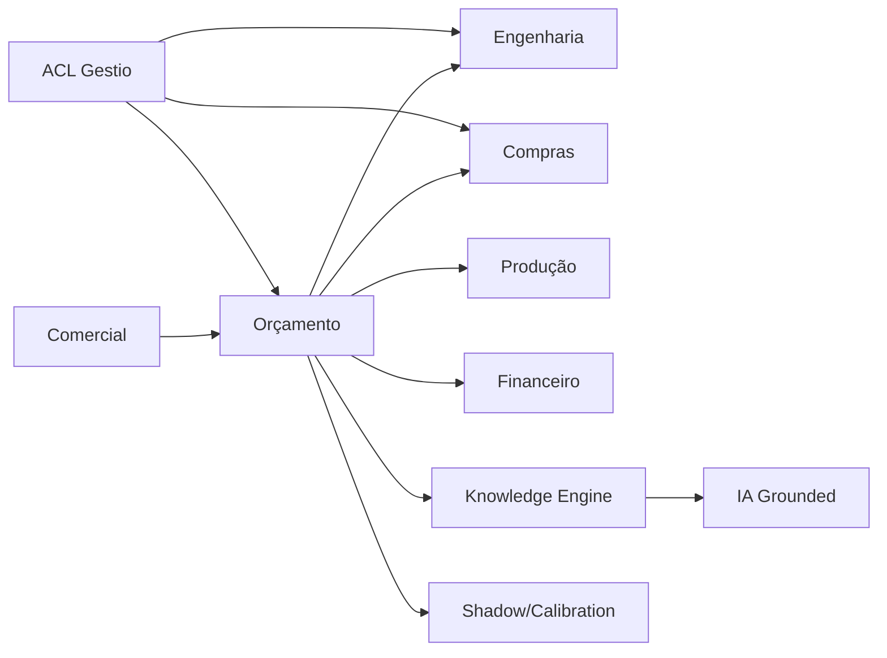

# Architecture Context Map

## Referências de contexto

- [02-Architecture/DDD.md](../02-Architecture/DDD.md)
- [02-Architecture/ACL.md](../02-Architecture/ACL.md)
- [06-Domains/OrcamentoOperacionalInglesa.md](../06-Domains/OrcamentoOperacionalInglesa.md)
- [11-ADRs/_INDEX.md](../11-ADRs/_INDEX.md)
